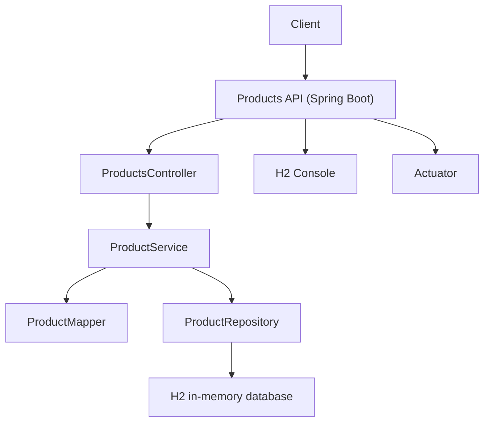

# Documentacion del microservicio: product_management

## Resumen
Microservicio CRUD para gestion de productos construido con Spring Boot y persistencia JPA sobre H2 en memoria.

- Context path: `/api/v1`
- Artefacto: `product_management`
- Stack principal: Spring Web MVC, Spring Data JPA, Validation, H2, Lombok, Actuator y springdoc-openapi

## Requisitos
- JDK 21
- Maven wrapper del proyecto: `mvnw` en Windows o `./mvnw` en Unix

## Estructura principal
- `src/main/java` contiene controllers, service, repository, model, dto, mapper y exceptions
- `src/main/resources/application.properties` contiene la configuracion de runtime
- `src/test/java` contiene las pruebas automatizadas

## Configuracion importante
- Base de datos: `jdbc:h2:mem:productdb`
- Usuario/clave H2: `exercise1` / `exercise1`
- Dialecto JPA: `org.hibernate.dialect.H2Dialect`
- Console H2: habilitada en `/h2-console`
- El servicio expone endpoints bajo `/api/v1/products`

## Modelo de dominio

### `ProductModel`
- `id`: `long`, generado por identidad
- `name`: nombre del producto
- `description`: descripcion opcional
- `price`: precio decimal
- `stock`: inventario
- `createdAt`: timestamp generado automaticamente con `@CreationTimestamp`

### DTOs
- `ProductRequestDTO`: entrada para crear y actualizar productos
- `ProductResponseDTO`: salida visible para el cliente
- `ErrorDTO`: respuesta de error con `code` y `message`

## Reglas de validacion
- `name` es obligatorio y no puede venir vacio
- `description` admite hasta 500 caracteres
- `price` debe ser positivo
- `stock` debe ser mayor o igual a 0
- El controller tambien valida manualmente campos requeridos antes de crear un producto

## Endpoints

### Listar productos
`GET /api/v1/products`

- Devuelve la lista completa de productos
- Si no hay registros, responde `404 Not Found`

### Buscar producto por id
`GET /api/v1/products/{id}`

- Busca un producto por su identificador
- Si no existe, responde `404 Not Found`

### Buscar producto por nombre
`GET /api/v1/products?name={name}`

- Busca el primer producto cuyo nombre coincida sin distinguir mayusculas/minusculas
- Requiere el query param `name`
- Si no encuentra coincidencias, responde `404 Not Found`

### Crear producto
`POST /api/v1/products`

Ejemplo de body:

```json
{
  "name": "Laptop",
  "description": "Equipo de trabajo",
  "price": 1200.5,
  "stock": 10
}
```

- Si `name` es vacio o `price` es `0`, responde `400 Bad Request`
- Si la validacion de Bean Validation falla, Spring puede devolver error de validacion segun la configuracion del entorno

### Actualizar producto
`PUT /api/v1/products/{id}`

- Si el producto existe, actualiza nombre, descripcion y precio
- Si no existe, el servicio crea un registro nuevo con el id indicado
- Si el producto no existe al consultar previamente, el controller responde `404 Not Found`

### Eliminar producto
`DELETE /api/v1/products/{id}`

- Elimina el producto indicado
- Si no existe, responde `404 Not Found`
- Si la eliminacion es exitosa, responde `204 No Content`

## Formato de error
Los errores personalizados usan el formato:

```json
{
  "code": "P-404",
  "message": "Product not found"
}
```

### Excepciones manejadas
- `NotFoundException` -> error funcional con estado HTTP configurable
- `BussinesException` -> error funcional con estado HTTP configurable
- `GlobalExceptionHandler` convierte ambas excepciones en `ErrorDTO`

## Flujo de componentes



## Ejemplos de respuestas

### Respuesta de exito para listado
```json
[
  {
    "id": 1,
    "name": "Laptop",
    "description": "Equipo de trabajo",
    "price": 1200.5,
    "stock": 10
  }
]
```

### Respuesta de error
```json
{
  "code": "P-404",
  "message": "Product not found"
}
```

## Comandos utiles

Ejecuta estos comandos desde la carpeta `product_management`.

### Limpiar y compilar
```powershell
.\mvnw clean compile
```

### Ejecutar la aplicacion
```powershell
.\mvnw spring-boot:run
```

### Ejecutar pruebas
```powershell
.\mvnw test
```

### Empaquetar JAR
```powershell
.\mvnw package
```

### Ejecutar una prueba concreta
```powershell
.\mvnw -Dtest=ProductManagementApplicationTests test
```

### Habilitar debug remoto
```powershell
.\mvnw spring-boot:run -Dspring-boot.run.jvmArguments="-agentlib:jdwp=transport=dt_socket,server=y,suspend=n,address=*:5005"
```

## Nota operativa
- El controller debe mantener separados los mappings por path o por parametros. En este proyecto, la busqueda por nombre usa `@GetMapping(params = "name")` para evitar conflicto con el listado general.
- Si cambias Java o Lombok, revisa tambien la configuracion del `maven-compiler-plugin`.

## Checklist pre-release
- Validar compilacion y pruebas
- Revisar que H2 y el contexto `/api/v1` sigan alineados con el entorno
- Confirmar que no se han introducido credenciales reales en `application.properties`

