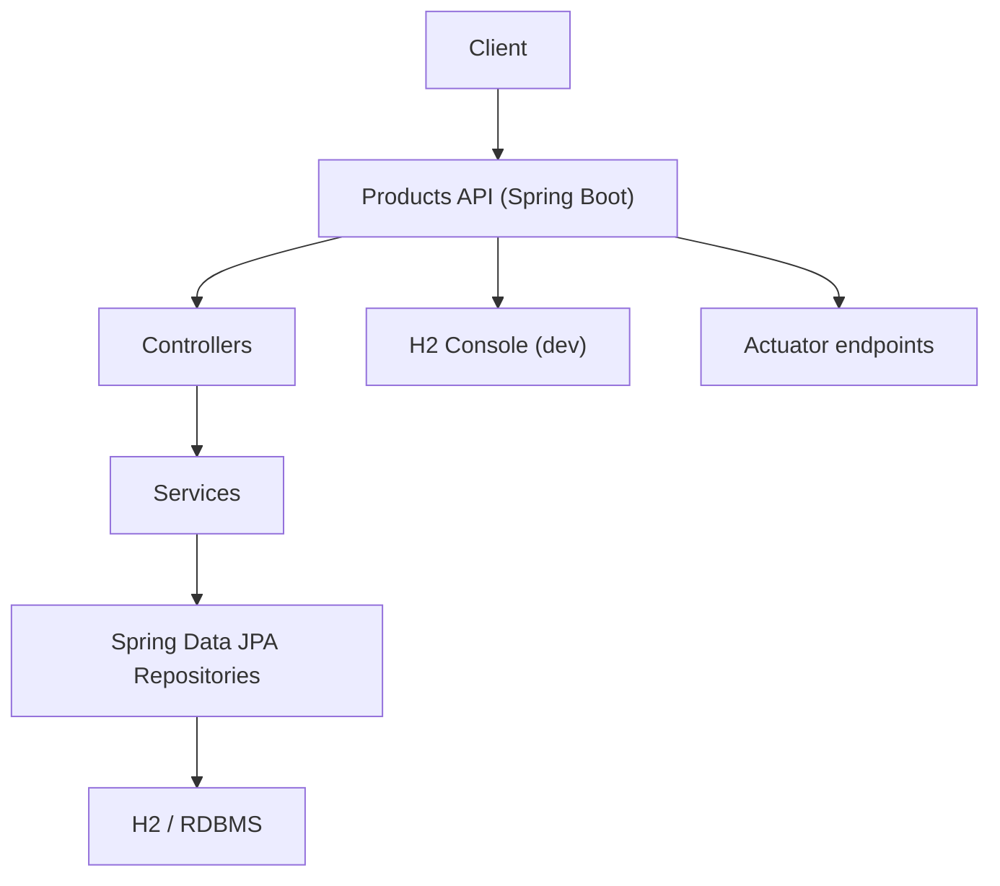

# Documentación del microservicio: product_management

## Resumen
Servicio de gestión de productos (CRUD) construido con Spring Boot.

- Context path: `/api/v1` (configurado en `application.properties`).
- Base: aplicación Spring Boot empaquetada con Maven (wrapper incluido).

## Requisitos
- JDK: 25 (o la versión objetivo del proyecto).
- Maven: usar `./mvnw` (Windows: `mvnw.cmd`) para consistencia.

## Estructura principal
- `src/main/java` — código fuente (controllers, service, repository, model, dtos).
- `src/main/resources` — `application.properties`, plantillas y recursos estáticos.
- `src/test/java` — pruebas unitarias / de integración.

## Configuración importante
- Archivo: `product_management/src/main/resources/application.properties`.
  - Verifica que la propiedad del dialecto JPA esté bien escrita: `spring.jpa.database-platform=org.hibernate.dialect.H2Dialect` (hay un posible typo `spring.jpadatabase-platform`).
  - H2 en memoria usado por defecto: `spring.datasource.url=jdbc:h2:mem:productdb`.
  - H2 console: `spring.h2.console.enabled=true` y `spring.h2.console.path=/h2-console`.

## Endpoints y comportamiento

## Ejemplos de endpoints (Controller)

A continuación un ejemplo sencillo de `ProductsController` usando Spring Web MVC y servicios/DTOs del proyecto. Adáptalo según tus DTOs y nombres de servicio.


### Endpoints resumidos

- `GET /api/v1/products` — Listar productos
- `GET /api/v1/products/{id}` — Obtener producto por id
- `POST /api/v1/products` — Crear producto
- `PUT /api/v1/products/{id}` — Actualizar producto
- `DELETE /api/v1/products/{id}` — Eliminar producto

## Diagrama simple de componentes

Diagrama básico mostrando componentes principales del microservicio:



---

Si quieres, puedo generar ejemplos de DTOs y respuestas JSON para cada endpoint o añadir un diagrama más detallado (incluyendo mensajería o gateway). ¿Qué prefieres?
## Consejos rápidos
- Si usas Lombok y cambias la versión de Java, actualiza `lombok` y la configuración del `annotationProcessor` para evitar errores de compilación.
- Para errores de tipo JPA "Not a managed type", confirma que tus entidades tienen `@Entity` y están en paquetes que Spring Boot escanea (mismo paquete o sub-paquetes de la clase con `@SpringBootApplication`).

## Comandos útiles (Windows PowerShell / CMD)
Usa el wrapper del proyecto para ejecutar comandos reproducibles.

- Limpiar y compilar:
```bash
.\product_management\mvnw -f product_management\pom.xml clean test-compile
```

- Ejecutar la aplicación (modo desarrollo):
```bash
.\product_management\mvnw -f product_management\pom.xml spring-boot:run
```

- Ejecutar pruebas unitarias / de integración:
```bash
.\product_management\mvnw -f product_management\pom.xml test
```

- Empaquetar JAR:
```bash
.\product_management\mvnw -f product_management\pom.xml package
```

- Ejecutar con una JDK específica (PowerShell):
```powershell
$env:JAVA_HOME='C:\Users\Sebastian\AppData\Local\jdks\jdk-25.0.2'
$env:Path = $env:JAVA_HOME + '\;' + $env:Path
.\product_management\mvnw -f product_management\pom.xml spring-boot:run
```

- Compilar y ejecutar una sola clase de prueba (ej.: ProductManagementApplicationTests):
```bash
.\product_management\mvnw -f product_management\pom.xml -Dtest=ProductManagementApplicationTests test
```

- Limpiar la caché de dependencias local (útil si hay conflictos):
```bash
.\product_management\mvnw -f product_management\pom.xml dependency:purge-local-repository -DreResolve=true
```

## Debug y desarrollo
- Ejecuta `spring-boot:run` con el parámetro `-Dspring-boot.run.jvmArguments='-agentlib:jdwp=transport=dt_socket,server=y,suspend=n,address=*:5005'` para habilitar debug remoto.

## Checklist pre-release
- Verificar que todas las pruebas pasen (`mvn test`).
- Ejecutar escaneo de vulnerabilidades en dependencias (CVE) si aplica.
- Actualizar `application.properties` según el entorno (prod/staging/dev) y asegurarse de no incluir credenciales en el repo.

